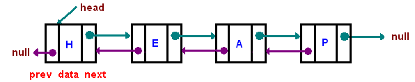

# Data structures and algorithms

## Data Structures

### Dictionary

You can add keys in to a dictionary \(or hash map\) and get or modify the values of the keys you added. The basic idea is that your dictionary converts your key into an index then it sends you to the index where your key's value lives. In other words, a dictionary stores everything in a contiguous array and let's you access its indices by hashing your input keys. z

```text
a dictionary is basically used like this

map: { gpa: 3.5 }
map.gpa = map.gpa + 0.1
map: { gpa: 3.6}
map.courses = 3
map: { gpa: 3.5, courses: 3 }
```

In our computer science classes, we learn that if a collision, a case when two input strings produce the same hash value, occurs in our dictionary, the chaining or linear probing could occur. 

#### Chaining

When we chain, we just reference the key-value pair as a referenced element of the key it collided with. We basically make linked lists spawn from the indices of arrays.

```text
hash("cat") = hash("dog") = hash("tortoise") = 1

[1] -> ["cat", "meows"] -> ["dog", "barks"] -> ["tortoise", "beats the hare"]
[2] -> ["python", "slithers"]
[3] -> ["mouse", "squeaks"]

chaining is good for teaching about hash tables, but they have a lot of overhead
so we don't even think about using them in the real world 
```

#### Linear Probing

In linear probing, we take the next available slot in a contiguous array if the hashed key's position in the array is filled. 

```text
[
  0,
  ("cat", "meows"),
  0,
  0,
  ("python", "slithers"),
  ("mouse", "squeks)
]

let c be equal to hash("cat")
we insert ("dog", "barks"), but it collides with c, so move to c + 1
we insert ("tortoise", "beats the hare"), but it collides with c and c + 1

[
  0,
  ("cat", "meows"),
  ("dog", "barks"),
  ("tortoise", "beats the hare"),
  ("python", "slithers"),
  ("mouse", "squeks)
]

the arrays will always resize whenever they get adequately filled
```


#### Randomized Linear Probing

I read the source code of Python and found out that they use a variation of linear probing where the probing process is more sophisticated than just incrementing the index in cases of collisions. Their approach is to hash again when there is a collision, but explaining how that works is beyond the scope of this text. [You can read it in their source code if you want.](https://github.com/python/cpython/blob/master/Objects/dictobject.c)


```text
randomized linear probing in Python (note: dictionary resizes if it is 2/3 full) 

[
  0,
  0,
  0,
  0,
  0,
  0,
  0,
  ("cat", "meows")
]

insert ("dog", "barks") which collides at index 7 so hash again (assume we get 4)
insert ("tortoise", "beats the hare") which collides at index 7 so hash again (0)

[
  ("tortoise", "beats the hare"),
  0,
  0,
  0
  ("dog", "barks"),
  0,
  ("cat", "meows")
]

The subsequent hash will use the key and the current index derived from first hash
This is literally what you will find in the Python source code

#define PERTURB_SHIFT 5
j = ((5*j) + 1) mod 2**i
perturb >>= PERTURB_SHIFT;
j = (5*j) + 1 + perturb;
use j % 2**i as the next table index;
```

### Stacks and queues

Stacks and queues are simple data structures that act as containers for elements. The only difference between them is that in a stack, what you put in last is the one you take out first, while in a queue, the one you put in first is the one you take out first.

Queues become more interesting when you start working with distributed systems because they are used all the time as message queues. A message queue accepts information from some component while allowing another component to process information in the order they got added.


#### Deques

Sometimes we use a deque \(double ended queue\) to represent a container that can act as a queue and a stack in both directions. In the real world, you wouldn't want to overuse deques because your coworkers could misuse your deque as a stack even though you're using the deque as a queue. In other words, use a stack for stack-based containers, a queue for queue-based containers, and a deque if you really need both.


#### Circular Buffers

You might have also heard about circular buffers. A circular buffer, or ring buffer, is just a queue that overwrites its oldest elements whenever it becomes full. This makes queues more interesting because now you know [how voice assistants like Siri, Alexa, and Cortana can always respond when you call for them](https://patents.justia.com/patent/20190341045).



### Linked lists vs arrays

Linked lists are an alternative to arrays because arrays are fixed in size while linked lists are not. Arrays are fixed in size because they physically take up a contiguous block of memory in your computer which is why you can access their elements by their index. A linked list, on the other hand, takes up whatever free space is available in your computer which is why each node, except for the root node, has to be referenced by at least one other node.

In garbage-collected languages like Java and Python, nodes are released from memory when they are no longer being referenced from other nodes. There are other differences, such as how CPU caching works with array values \(generally faster\) and linked list values \(generally slower\), but they are beyond the scope of this text. 

#### Singly-linked list

* You can use this to implement a stack \(or a queue by adding another pointer that references the tail node\).


#### Doubly-linked list

* You can use this to implement a deque by adding another pointer that references the tail node.



#### Circular linked list

* You can use this to implement a dynamically sized circular buffer.


### Heap

Heaps are usually used to implement priority queues, a special type of queue where the minimum or maximum element, the extreme value, will always be the at the front of the queue. **A heap is just an array of elements that, conceptually, form a binary tree \(not a binary search tree\) where the root element is the extreme value of the array.**

Inserting or removing the extreme value will cause the heap to be no longer valid, so it rebalances itself until it becomes valid. A valid heap will satisfy the following:

* It is a binary tree which means that all of its nodes can only have up to two children nodes
* The value stored in each node is either larger/smaller or equal to than the values stored in its children.


### Trie

A trie is a niche data structure used for verifying if some string exists in a collection. Although not as important as the other data structures here, I mention it because you might get asked to implement a spell checker or an autocomplete algorithm at an interview. **If your interviewer asks you why use a trie instead of a dictionary or a hash map, it's because you have to iterate through a dictionary's keys to search for your target word**—**O\(n\) comparisons. A trie would only check for as many times as there are characters in your target word**—**O\(m\) with m as the length of the target word.**

You can implement a trie as a dictionary of letters where each letter acts as a dictionary for other letters that have the same property.


You can also optimize the trie above by compressing it. You simply need to group edges \(the links between nodes\) in a chain of nodes when their nodes only have single edges. In other words, you flatten the chain of nodes if possible to save space.

The following is just a compressed tree, but[ people sometimes refer to it as a "Patricia tree"](https://xlinux.nist.gov/dads/HTML/patriciatree.html).


### Binary search tree

A binary search tree is just a binary tree, a tree where each node can have up to two children nodes, with the following properties:

* the node's left child has a smaller value than the node
* the node's right child has a greater value than the node

Searching for an element in an unbalanced binary search tree would take more time than in a balanced one. This is because an unbalanced tree could literally look like linked list where each node only has a single child. This might happen if you insert values into a binary search tree in increasing order.


### Graph

A graph is a set of vertices connected by edges. The following image illustrates what a vertex is and what an edge is:   


Usually graphs are described by their properties, so here's a few of them:

#### Directed vs undirected

* In a directed graph, X \(the origin vertex\) can connect to a Y \(destination vertex\), but Y does not necessarily have to connect to X. However, X being connected to Y and Y being connected to X is a still a valid directed graph.
* An undirected graph is just a directed graph where each connection is symmetric; that is if any vertex A connects to vertex Y, vertex Y must connect to vertex X


#### Cyclic vs acyclic

* A graph is cyclic if some vertex can return to itself after walking \(traversing one vertex at a time without backtracking\) a path of with at least 2 more vertices. This means that all cycles form polygons with the simplest cycle forming a triangle. An undirected graph of two vertices is not a cycle. A cycle is found when we can walk from X to Y to Z then to X again, but walking from X to Y to Z to Y to X is not a valid cycle because we backtracked.
* You can represent your required college courses as an acyclic graph because your courses do not require you to retake their prerequisites.

#### Weighted vs unweighted

* A graph is weighted if its edges have some sort of value. The value could represent things like the distance between two cities, the time it takes to travel between two airports, and so on.

## Sorting Algorithms

### Selection sort vs insertion sort

* In selection sort, you start by looking for the smallest element in the unsorted array then replacing the element at its first index with the smallest element. The first index is now your sorted subarray and the rest is an unsorted subarray. You gradually sort your array by continuously replacing the element at  the unsorted subarray's first index with its smallest element.
* In insertion sort, you just shift elements to the right if they are larger than your current element.You do this until you sort the entire array.
* If comparisons are cheaper, use selection sort because insertion sort might be too expensive if each element in your unsorted array is a few megabytes or more in size. Insertion sort copies elements whenever you shift elements in the array. Otherwise, always use insertion sort because it is usually faster especially for arrays that are almost sorted.

### Merge sort

My friend got interviewed for a Google position and they asked him to implement merge sort during a telephone interview. The idea of merge sort is you keep dividing an array over and over until you get a subarray for each element in the original array. You combine these one-element subarrays into sorted two-element subarrays, then into sorted four-element subarrays, and so on until all of your subarrays are sorted.


### Quick sort

Quick sort is like merge sort but it partitions the array rather than dividing it in half. You basically choose a pivot element and place smaller elements to the left side of it and larger elements to the right. Perform the same operations for the subarrays of smaller elements and larger elements until you only get sorted subarrays. After that, merge the subarrays together and your array is now sorted.



####  Hybrid sorting algorithms

Timsort is Python's implementation for its built-in list `sort` function. Timsort is a combination of merge sort and insertion sort. It works by dividing the array in half over and over again until it reaches a size where the subarrays can be sorted by insertion sort. Those sorted subarrays are then sorted by the merge part of merge sort afterwards. In Python they reduce the number of comparisons by using a galloping search approach. They basically use a smarter version of binary search to locate insertion points then sort elements in bulk. ****[You can read the source code here if you want.](https://github.com/python/cpython/blob/dd754caf144009f0569dda5053465ba2accb7b4d/Objects/listobject.c)


## General

### Time and space complexity

This is usually asked in most technical interviews, so it is good to know how to compute time and space complexity. Here is a list of common time complexities that you should know about:

* O\(1\) - accessing an element in a hash table
* O\(log\(n\)\) - binary search
* O\(n\) - iterating over an array
* O\(n\*log\(n\)\) - merge/quick sort
* O\(n^2\) - iterating over an array then iterating over its remaining elements \(selection sort\) 
* O\(2^n\) or O\(c^n\) - iterating over all possible subsets of a set. Imagine trying all combinations of a 10-digit password that only had 1's and 0's. This will take 2^10 comparisons and it will be painfully slow.

Space complexity is just the amount of extra space used when solving a question. This is usually either O\(1\) if you didn't create any array or dictionary while solving your interview question, O\(n\) if you had to create another array, or O\(m\) where m denotes auxiliary space \(like the number of unique words in a paragraph\).  

### Recursion

A lot of tree/graph-based problems will use recursion. Recursion is just another way of writing functions that return itself multiple times until a base case is reached. Once a base case is reached, the function stops execution.


#### Tail-call optimization

Tail-call optimization is a process of making recursive functions less expensive for the computer. Recursive calls typically create something called a stack frame which it keeps in memory until the entire recursion process ends.

Here's an example of a non-tail-recursive function:

```text
def factorial(n):
  if n == 1: return 1
  return n * factorial(n - 1)

It suspends the recursive calls:

fac_10 = factorial(10)

factorial(10) -> 10 * factorial(9)
  factorial(9) -> 9 * factorial(8)
    factorial(8) -> 8 * factorial(7)
      factorial(7) -> 7 * factorial(6)
      ...
      factorial(7) -> 5040
    factorial(8) -> 40320
  factorial(9) -> 362880
factorial(10) -> 3628800

fac_10 is equal to 3628800

If n is large, you will crash from a "stack-overflow exception" error
```

This one is an example of a tail-recursive function:

```text
def factorial(n, total=1):
  if n == 1: return total
  return factorial(n - 1, n * total)
  
Unlike the above, this should just reuse the same stack frame

fac_10 = factorial(10)

factorial(10) -> factorial(9, 10)
factorial(9, 10) -> factorial(8, 90)
...
factorial(2, 1814400) -> factorial(1, 3628800)

```

**Some languages like JavaScript and Python, as of July 2020, do not support tail-call optimization. This means that even if you write the tail-recursive version of a function, it will still run as the non-tail-recursive version and consume multiple stack frames.** 

Therefore, the rule is to not rely too much on recursive functions when coding JavaScript or Python projects. Maybe you can fare better by reducing the number of recursive functions in your codebase.



