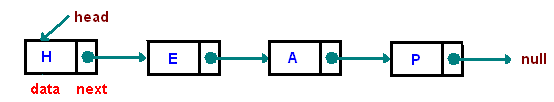

# Data structures and algorithms

## Data Structures

### Dictionary

You can add keys in to a dictionary \(or hash map\) and get or modify the values of the keys you added. The basic idea is that your dictionary converts your key into an index then it sends you to the index where your key's value lives. In other words, a dictionary stores everything in a contiguous array and let's you access its indices by hashing your input keys. z

```text
a dictionary is basically used like this

map: { gpa: 3.5 }
map.gpa = map.gpa + 0.1
map: { gpa: 3.6}
map.courses = 3
map: { gpa: 3.5, courses: 3 }
```

In our computer science classes, we learn that if a collision, a case when two input strings produce the same hash value, occurs in our dictionary, the chaining or linear probing could occur. 

#### Chaining

When we chain, we just reference the key-value pair as a referenced element of the key it collided with. We basically make linked lists spawn from the indices of arrays.

```text
hash("cat") = hash("dog") = hash("tortoise") = 1

[1] -> ["cat", "meows"] -> ["dog", "barks"] -> ["tortoise", "beats the hare"]
[2] -> ["python", "slithers"]
[3] -> ["mouse", "squeaks"]

chaining is good for teaching about hash tables, but they have a lot of overhead
so we don't even think about using them in the real world 
```

#### Linear Probing

In linear probing, we take the next available slot in a contiguous array if the hashed key's position in the array is filled. 

```text
[
  0,
  ("cat", "meows"),
  0,
  0,
  ("python", "slithers"),
  ("mouse", "squeks)
]

let c be equal to hash("cat")
we insert ("dog", "barks"), but it collides with c, so move to c + 1
we insert ("tortoise", "beats the hare"), but it collides with c and c + 1

[
  0,
  ("cat", "meows"),
  ("dog", "barks"),
  ("tortoise", "beats the hare"),
  ("python", "slithers"),
  ("mouse", "squeks)
]

the arrays will always resize whenever they get adequately filled
```


#### Randomized Linear Probing

I read the source code of Python and found out that they use a variation of linear probing where the probing process is more sophisticated than just incrementing the index in cases of collisions. Their approach is to hash again when there is a collision, but explaining how that works is beyond the scope of this text. [You can read it in their source code if you want.](https://github.com/python/cpython/blob/master/Objects/dictobject.c)


```text
randomized linear probing in Python (note: dictionary resizes if it is 2/3 full) 

[
  0,
  0,
  0,
  0,
  0,
  0,
  0,
  ("cat", "meows")
]

insert ("dog", "barks") which collides at index 7 so hash again (assume we get 4)
insert ("tortoise", "beats the hare") which collides at index 7 so hash again (0)

[
  ("tortoise", "beats the hare"),
  0,
  0,
  0
  ("dog", "barks"),
  0,
  ("cat", "meows")
]

The subsequent hash will use the key and the current index derived from first hash
This is literally what you will find in the Python source code

#define PERTURB_SHIFT 5
j = ((5*j) + 1) mod 2**i
perturb >>= PERTURB_SHIFT;
j = (5*j) + 1 + perturb;
use j % 2**i as the next table index;
```

### Stacks and queues

Stacks and queues are simple data structures that act as containers for elements. The only difference between them is that in a stack, what you put in last is the one you take out first, while in a queue, the one you put in first is the one you take out first.

Sometimes we use a deque \(double ended queue\) to represent a container that can act as a queue and a stack in both directions. In the real world, you wouldn't want to overuse deques because your coworkers could misuse your deque as a stack even though you're using the deque as a queue. In other words, use a stack for stack-based containers, a queue for queue-based containers, and a deque if you really need both.


#### Circular Buffers

You might have also heard about circular buffers. A circular buffer, or ring buffer, is just a queue that overwrites its oldest elements whenever it becomes full. This makes queues more interesting because now you know [how voice assistants like Siri, Alexa, and Cortana can always respond when you call for them](https://patents.justia.com/patent/20190341045).



### Linked lists vs arrays

Linked lists are an alternative to arrays because arrays are fixed in size while linked lists are not. Arrays are fixed in size because they physically take up a contiguous block of memory in your computer which is why you can access their elements by their index. A linked list, on the other hand, takes up whatever free space is available in your computer which is why each node, except for the root node, has to be referenced by at least one other node.

In garbage-collected languages like Java and Python, nodes are released from memory when they are no longer being referenced from other nodes. There are other differences, such as how CPU caching works with array values \(generally faster\) and linked list values \(generally slower\), but they are beyond the scope of this text. 

#### Singly-linked list

* You can use this to implement a stack \(or a queue by adding another pointer that references the tail node\).



#### Doubly-linked list

* You can use this to implement a deque by adding another pointer that references the tail node.


#### Circular linked list

* You can use this to implement a dynamically sized circular buffer.


### Heap

Heaps are usually used to implement priority queues, a special type of queue where the minimum or maximum element, the extreme value, will always be the at the front of the queue. **A heap is just an array of elements that, conceptually, form a binary tree \(not a binary search tree\) where the root element is the extreme value of the array.**

Inserting or removing the extreme value will cause the heap to be no longer valid, so it rebalances itself until it becomes valid. A valid heap will satisfy the following:

* It is a binary tree which means that all of its nodes can only have up to two children nodes
* The value stored in each node is either larger/smaller or equal to than the values stored in its children.


### Trie

A trie is a niche data structure used for verifying if some string exists in a collection. Although not as important as the other data structures here, I mention it because you might get asked to implement a spell checker or an autocomplete algorithm at an interview. **If your interviewer asks you why use a trie instead of a dictionary or a hash map, it's because you have to iterate through a dictionary's keys to search for your target word**—**O\(n\) comparisons. A trie would only check for as many times as there are characters in your target word**—**O\(m\) with m as the length of the target word.**

You can implement a trie as a dictionary of letters where each letter acts as a dictionary for other letters that have the same property.


You can also optimize the trie above by compressing it. You simply need to group edges \(the links between nodes\) in a chain of nodes when their nodes only have single edges. In other words, you flatten the chain of nodes if possible to save space.

The following is just a compressed tree, but[ people sometimes refer to it as a "Patricia tree"](https://xlinux.nist.gov/dads/HTML/patriciatree.html).


### Binary search tree


### Graph

## Sorting Algorithms

### Selection sort vs insertion sort

### Merge sort

### Quick sort

## General

### Time and space complexity

### Recursion


