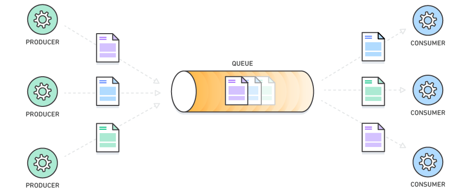

# Stacks and Queues Review

## Quick Review

Stacks and queues are conceptually easy to understand so we won't spend too much time on them.

You can image a stack as the stack of shipping containers stacked on a cargo ship. The containers are placed on top of each other. Before the ship departs, the containers placed on top of each other with the first container being at the bottom and the last container being at the top. Once the ship arrives, containers are removed starting with the topmost container until the bottommost container is removed.

A queue removes elements at the same order they got added in. You can see a queue in real-life when you go to a drive thru. The first one in line gets to order first, the second one gets to go second, the third ones goes third, and so on. Queues become more interesting when you start working with distributed systems because they are used all the time as message queues. A message queue accepts information from some component while allowing another component to process information in the order they got added.

Stacks support a first-in-first-out \(or last-in-last-order\) sequence when handling elements, while a queue supports first-in-first-out sequence. Both of them should have, at the very minimum, these operations:

* Queue: push, pop, and peek
* Stack: enqueue, dequeue, and peek

## Bonus: Deque

A deque is just a double-ended queue. It allows you to push/enqueue and pop/dequeue from either end of the container. You might be thinking that a deque is always better than using a stack or a queue because it can act like either, but this is always not the case. One of the problems with using a deque is that one of your team members might do a non-stack operation on a deque you're using as a stack. If that happens, your program might fail and you'll have to spend developer resources in looking for the bug. In other words, if you just need a stack, use a stack, and if you just need a queue, use a queue.

One nifty use case of a deque can be seen with your browser's page history. You can go back a few pages   by pressing the "back" button, and then you can return to the original page through the "forward" button. Technically, you can do this \(i.e. a redo/undo feature\) by creating two stacks, but a deque is just more convenient.

